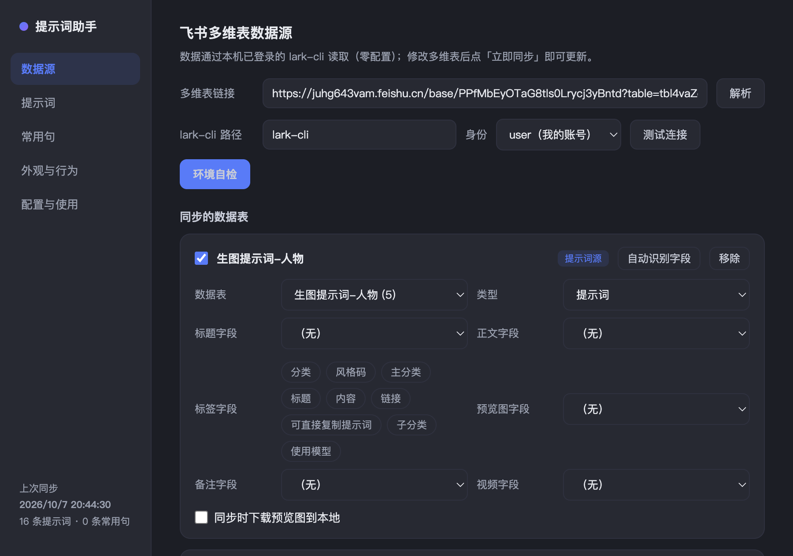

# 提示词助手

[](https://github.com/Anna-YC/prompt-assistant/releases/latest)
[](LICENSE)
[](https://github.com/Anna-YC/prompt-assistant/releases/latest)
[](https://www.electronjs.org/)

**常驻系统托盘的提示词速查 / 一键复制工具**：数据来自你自己的飞书多维表，
配合浏览器剪藏插件实现「网页上看到 → 一键剪藏 → 托盘随手取用」的闭环，无需任何密钥配置——
直接复用本机已登录的 `lark-cli` 身份读取多维表。

| 吸附面板速查 | 设置 · 数据源 | 设置 · 提示词 |
| :---: | :---: | :---: |
|  |  |  |

> 截图为 macOS 实机运行效果：屏幕右缘悬浮把手悬停展开、卡片带封面图与两级分类（常用词 / 生图词 / 视频词）、点击即复制全文。

## 下载安装

到 [GitHub Releases](https://github.com/Anna-YC/prompt-assistant/releases/latest) 下载对应平台的安装包：

| 平台 | 文件 | 安装方式 |
| --- | --- | --- |
| **macOS**（Apple Silicon） | `PromptAssistant-x.y.z-mac-arm64.dmg` | 打开 dmg，把「提示词助手」拖入「应用程序」。首次打开若提示「无法验证开发者」：右键 .app →「打开」→ 再点「打开」（本地构建未做公证） |
| **Windows** x64 | `PromptAssistant-Setup-x.y.z.exe` | 双击运行安装向导，支持自定义安装目录 |

安装后打开 设置 → 数据源 → 环境自检 →「一键自动配置」即可完成环境准备
（自动下载安装 lark-cli：mac 为 darwin-arm64 版、Windows 为 win-x64 版，均走国内镜像并做 sha256 校验；
无需安装 Node/npm）。

## 工作流：剪藏插件（存） × 提示词助手（用）

本软件需配合**浏览器剪藏插件**使用，二者以**飞书多维表**为数据中台：

```
浏览器剪藏插件 ──写入──▶ 飞书多维表（数据中台） ──同步──▶ 提示词助手（托盘速查/复制/预览）
   负责“存”：网页上看到的        表内按字段存放：           负责“用”：右键一键复制、
   提示词/图片/视频一键收集       标题、提示词、标签、         右侧吸附面板预览、
   进多维表对应数据表             封面、视频、来源链接         高频统计、常用词管理
```

- **剪藏端**：浏览器「网页剪藏插件」（v1.8.3，安装包见 [GitHub Releases](https://github.com/Anna-YC/prompt-assistant/releases/latest)，
  图文教程见下方说明文档），
  在浏览器里把看到的提示词、参考图、视频一键剪藏进多维表（写入哪张表，本软件就同步哪张表）；
- **使用端**：本软件同步多维表后，在托盘/吸附面板里按 大类（常用词/生图词/视频词）→ 细分（人物/环境/…）浏览，点击即复制；

### 剪藏插件说明文档

<https://zk5ckzju3h.feishu.cn/docx/BIxhdJC0GoOvr3xHtDlcztIqnRd>（软件内 设置 → 配置与使用 → 「剪藏插件下载与图文教程」也可打开）

要点摘录：

1. **安装插件**：下载 `feishu-web-clipper-1.8.3.zip`（[Releases](https://github.com/Anna-YC/prompt-assistant/releases/latest) 或说明文档附件）解压 → 浏览器扩展程序页 → 「加载已解压的扩展程序」→ 选中解压文件夹；
2. **准备多维表**：打开文档内的「网页剪藏库」模板链接 → **务必先创建副本到自己空间**（复制范围选「仅结构」，表名可自定义）；
3. **配置机器人**：飞书开放平台创建企业自建应用 → 权限管理开通 `bitable:app`、`bitable:app:readonly`、`drive:file:upload`、`base:field:update`（1.8.3 起新标签自动同步需要） → 发布上线 → 在自己多维表「… → 添加文档应用」中加入该应用并设为【可编辑】；
4. **标签同步**：多维表里自定义好分类/标签后，在插件设置里点同步即可拉取；
5. **媒体限制**：支持图片与视频，视频建议 30M 以内；
6. 最后把**自己那份多维表**的链接粘贴到 提示词助手 设置 → 数据源 → 解析，即可同步使用。
- **字段约定**（剪藏写入时使用这些列名，本软件可自动识别映射）：
  `标题`、`可直接复制提示词`（或 `提示词`/`内容`）、`子分类`/`分类`（标签）、`封面`（预览图）、
  `成品视频`（视频预览）、`链接`（来源）、`提示词用途`/`作用`（常用词表用法）；
- 表名含「提示词」的数据表会在同步时自动接入，无需手工配置。

## 快速开始

```bash
npm install          # 已安装可跳过
npm start            # 或双击「启动提示词助手.vbs」（Windows）/「启动提示词助手.command」（macOS）
```

启动后：

- **托盘图标**（Windows 右下角 / macOS 顶部菜单栏，Mac 图标随深浅色模式自动反色），常驻不退出。
- **左键托盘**：打开 / 收起右侧吸附面板（固定展开，不随鼠标收回）。
- **右键托盘**：弹出常用提示词菜单（条目少时平铺、多时按标签分组），点击即复制全文。
- **屏幕右缘悬浮把手**：鼠标移上去面板滑出；移开约 0.55 秒后自动吸附收回，只留把手。
- 面板内：搜索、标签筛选、卡片点击复制；卡片只显示标签 + 标题 + 两行预览，保持低密度。
- 卡片悬停出现 ★（设为常用，进入托盘右键菜单）、⧉（复制）、外链图标。
- **媒体预览**：已接入「生图提示词-人物/环境/生物/海报/创意图片」与「视频提示词-成品/创意」共 7 张表（539 条）。
  卡片左侧为封面图（滚动到可视区自动懒加载）或视频（带 ▶ 角标，点击后下载并内联播放，支持进度拖动）；
  右侧为标签 + 标题 + 可复制的提示词正文。媒体缓存：Windows 在 `%AppData%\提示词助手\`、
  macOS 在 `~/Library/Application Support/提示词助手/media/`，二次打开秒显。
  点击封面图在**应用内放大预览**（深色 lightbox，ESC 或点击关闭），不会打开任何外部窗口。
- **两级分类**：提示词标签页内第一行为大类（常用词 / 生图词 / 视频词，带数量），第二行为细分
  （生图词→人物/环境/生物/海报/创意图片；视频词→成品/创意；常用词→按标签如人物设定/场景搭建），逐级点选筛选。

## 设置页（面板齿轮图标 / 托盘「设置…」）

| 标签 | 功能 |
| --- | --- |
| 数据源 | 多维表链接解析、lark-cli 路径、身份（user/bot）、同步哪些表、字段映射（可「自动识别字段」）、是否下载效果预览图、自动同步间隔、立即同步 |
| 提示词 | 浏览已同步提示词；设为常用 / 复制；新建仅存本地的提示词 |
| 常用句 | 本地短文本快捷复制项的增删改、设为常用 |
| 外观与行为 | 浅色/深色主题、主题色、吸附边（右/顶）、面板宽度、预览行数、收回延时、预览图开关、复制提示、开机自启 |
| 配置与使用 | 图文说明页：首次配置 5 步流程（环境/登录/多维表/剪藏插件/接入同步）、日常用法、数据存放位置、常见问题 |

## 数据是怎么来的

1. 应用通过本机 `lark-cli`（已登录你的飞书账号）调用多维表接口，分页拉取启用表的记录；
2. 按字段映射归一化为 `{标题, 正文, 标签, 预览图, 备注}`，缓存到用户数据目录的 `cache.json`
   （Windows：`%AppData%\提示词助手\`；macOS：`~/Library/Application Support/提示词助手/`），离线时仍可使用上次同步结果；
3. 「效果」等附件字段可选下载到媒体缓存目录，在卡片右侧显示缩略图；
4. 默认同步表为「常用提示词库」（标题=提示词用途、正文=提示词、标签=作用、预览图=效果）。
   想同步其它表（如「生图提示词-人物」「视频提示词-成品提示词」）：设置 → 数据源 → 添加数据表 →
   选表 → 「自动识别字段」即可（已适配 标题/可直接复制提示词/分类 等常见列名）。

> 若换机器或 lark-cli 未登录：先 `lark-cli auth login`，或在设置页把 lark-cli 路径指向可执行文件。
> macOS 注意：通过 Homebrew / npm 用户目录安装的 lark-cli 不在图形应用的 PATH 里，
> 应用会自动探测 `/opt/homebrew/bin`、`~/.npm-global/bin` 等常见位置；仍找不到时在设置页填绝对路径即可。

## 目录结构

```
main.js            主进程：托盘 / 面板窗口 / 设置窗口 / 同步调度 / IPC
preload.js         contextBridge 安全桥
lib/store.js       配置与缓存读写、合并视图、常用标记
lib/feishu.js      lark-cli 封装（自动解析 JS 入口，免 cmd 引号问题）、字段映射、附件下载
lib/config.js      默认配置
src/panel.*        吸附面板 UI（悬停展开 / 离开收回 / 标签优先卡片）
src/settings.*     设置页 UI
tools/gen-icon.js  托盘图标生成（纯 Node 绘制 PNG）
```

## 换电脑 / 打包给别人用

**环境自检**：设置 → 数据源 → 「环境自检」→「**一键自动配置**」：自动从国内镜像下载安装 lark-cli
（官方单文件程序，带 sha256 校验；**无需安装 Node/npm**，应用内置运行环境），随后自动打开飞书登录页引导授权。
也可以逐项手动处理（去登录 / 去配置）。

**换机步骤**：
1. 新电脑装本软件（无需装 Node.js，运行环境内置）；
2. 打开应用 → 设置 → 数据源 → 环境自检 →「一键自动配置」（自动装 lark-cli + 引导登录飞书）；
3. 粘贴你的多维表链接 → 解析 → 立即同步；
4. 同步时**表名含「提示词」的表会自动接入**（字段映射自动识别），无需手工配表 ID。

**打包卫生（分发前检查）**：
- 安装包内不含任何个人数据：配置/加星/复制统计/文字缓存都在 `%AppData%\提示词助手\`（不随文件夹分发），日志也写在 AppData；
- 分发前建议：设置 → 外观与行为 → 「清空缓存」（清掉安装目录 `cache\media` 里你下载过的封面/视频），并删除安装目录内残留的 `cache\` 文件夹内容；
- 代码默认值不含任何个人多维表地址/表 ID（首次使用由使用者自行粘贴链接）；
- 启动脚本（vbs/bat）使用自身所在目录的相对路径，放到任何位置都能运行。

## 开发

```bash
node tools/gen-icon.js   # 重新生成托盘图标
npm start                # 开发运行（--enable-logging 可看渲染进程日志）
```

常用句与本地提示词保存在 `%AppData%\提示词助手\config.json` 的 `local` 节点；
托盘菜单「常用」= 打了 ★ 的条目，未打星时自动取前 14 条。

## 开源说明

本项目基于 [EConG37/prompt-assistant](https://github.com/EConG37/prompt-assistant)（MIT License），
在其 Windows 版基础上完成了 macOS / Apple Silicon 适配并持续维护，**所有平台改动均已保持 Windows 行为不变**，欢迎向上游回馈 PR。

- **许可证**：MIT —— 可自由使用、修改、分发，保留版权声明即可（见 [LICENSE](LICENSE)）
- **数据主权**：本工具不内置任何云端依赖与个人数据；你的提示词只存在你自己的飞书多维表与本机缓存里
- **欢迎贡献**：
  - 问题反馈 / 功能建议：[提 Issue](https://github.com/Anna-YC/prompt-assistant/issues)
  - 代码贡献：Fork → 修改 → PR（中文说明即可）
- **本地开发**：

  ```bash
  git clone https://github.com/Anna-YC/prompt-assistant.git
  cd prompt-assistant
  npm install
  npm start            # 开发运行（Windows 也可双击 启动提示词助手.vbs / mac 双击 .command）
  npm run dist:mac     # 打 macOS dmg（arm64）
  npm run dist:win     # 打 Windows nsis 安装包
  ```

- **Mac 适配要点**（对二次开发有兴趣的同学）：菜单栏模板图标（深浅色自适应）、`LSUIElement` 代理应用不占 Dock、
  GUI 受限 PATH 下自动探测 lark-cli（Homebrew / npm 用户目录）并注入增强 PATH、登录项自启走 AppleScript、
  应用图标 1024px 自动转 icns。

## 许可证

MIT © 2026 提示词助手 contributors（见 [LICENSE](LICENSE)）
